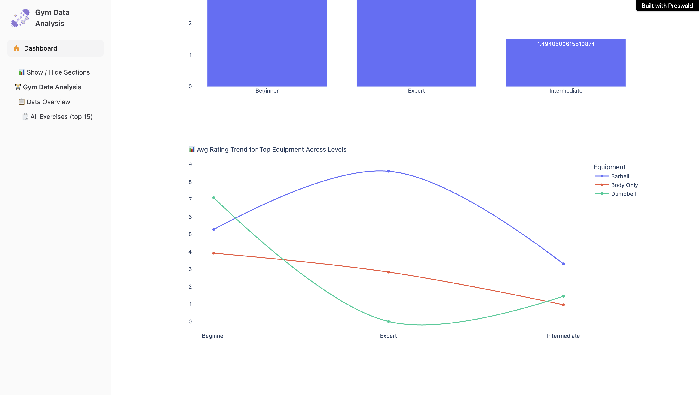

# 🏋️ Gym Data Analysis App

A lightweight Preswald project that lets you explore a gym-exercises dataset through interactive tables, charts and progress bars. Built with Python and Preswald’s SDK, it surfaces equipment usage, body-part focus, and rating trends at a glance.

---

## 📸 Screenshots

_Feel free to replace these with your own full-size exports._

|               Dashboard Overview               |                Equipment Usage (%)                 |
| :--------------------------------------------: | :------------------------------------------------: |
|  |  |

|                  Body-Part Focus                   |            Rating Trend by Top Equipment            |
| :------------------------------------------------: | :-------------------------------------------------: |
|  |  |

---

## 🔍 What You’ll See

- **Interactive Table**: Browse exercise Title, Type, Equipment, Level & Rating
- **Bar Charts**: Equipment usage & Body-part focus
- **Progress Bars**: Percentage share of each equipment & body part
- **Insights**: Avg. Rating by difficulty level + trend lines for top equipment

---

## 🚀 Quick Start

1. **Clone** this repo
2. Add your data CSV path in `preswald.toml` under `[data] gym_data = "data/megaGymDataset_cleaned.csv"`
3. Run:
   ```bash
   preswald run
   ```
